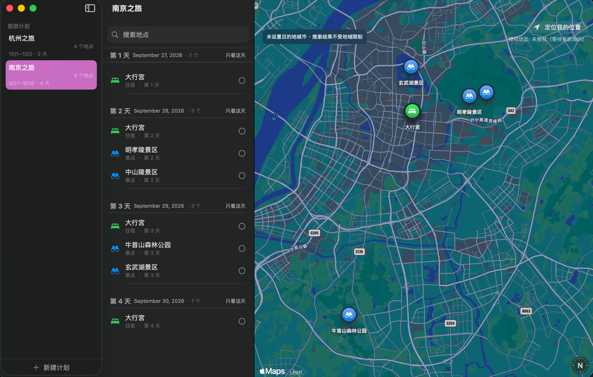

<div align="center">


# 📍 Pinplore

**macOS 原生旅游地点标注与按天行程规划工具**

搜索地点 → 加入计划 → 按天安排 → 一张地图总览整个行程

[](https://github.com/y2050802852-ux/Pinplore/releases/latest)


*纯原生 · 零 API key · 零第三方依赖 · 数据完全本地*

[English](README.md) | **[简体中文](README.zh-CN.md)**

</div>

---

## 📸 截图

<div align="center">

<p><sub>南京之旅：按天分区的行程列表（分类、评分、已去过标记），全部地点同步显示在右侧地图上。深色模式。</sub></p>
</div>

---

## ✨ 功能一览

### 🗺️ 地图与标注
- **联想搜索**：`MKLocalSearchCompleter` 边打边出候选；选中后地图先**预览**该地点，确认后才入库，不会误加
- **精确落点**：地图任意处**右键**或**长按 0.5 秒**落下预览图钉，手填名称、选择分类与天数后加入计划
- **定位我的位置**：一键请求 GPS，标记当前位置并聚焦相机（按钮下方常驻授权状态提示，权限问题一目了然）
- **分类着色**：景点 🔵 餐饮 🟠 住宿 🟢 交通 ⚪ 其他 🟣，Marker 颜色即分类
- **双击聚焦**：双击列表中的地点，地图飞到该点（1km 视距）
- **取消聚焦**：再次点击同一地点或点击地图空白处，弹性动画回到计划总览视角

### 📅 按天行程
- 新建计划时选择**起止日期**，自动生成 Day 1…N 分区
- **拖拽改天**：按住地点拖到任意一天——天内拖动调顺序，跨天拖动改归属，落点处显示蓝色插入线
- 空天也全部列出（「拖动地点到这里」占位），创建计划后立刻可以规划整段行程
- 「只看这天」聚焦模式：列表与地图同步只显示当天行程
- 缩短日期范围时，超出新范围的地点自动移到最后一天——**永不丢数据**

### 🧩 地点详情
- 备注、分类、天数、星级评分（1-5 星）、已去过 ✓、外部链接
- **复制地点**：酒店/餐厅要去多次？一键复制成独立副本，紧跟原件之后，互不影响
- **重命名**：详情面板直接编辑，或列表右键菜单

### ☁️ 备份与恢复（JSON）
- **⌘E 导出**：全部计划 + 去重后的地点打包成单个 JSON，默认保存到 `~/Documents/Trip Plan/`
- **⌘I 导入**，两种模式：
  - **追加合并**——保留本地现有数据；计划以副本加入；相同 `backupID` 的地点复用，绝不重复
  - **全量替换**——清空本地后按文件完整恢复（换机/回滚）
- 把文件放进 iCloud Drive / 坚果云 / U 盘即等于上云
- 格式带 `schemaVersion`，向前兼容

### 🛡️ 数据安全
- 删除计划前确认，删除后 **5 秒内可撤销**（快照级还原，共享地点不会被误删）
- 多对多模型：一个地点可属于多个计划；删除计划只删除「仅属于该计划的」地点

---

## 🚀 快速开始

### 安装（普通用户）

1. 前往 [**Releases**](https://github.com/y2050802852-ux/Pinplore/releases/latest) 下载 `Pinplore.dmg`
2. 双击打开，把 **Pinplore.app** 拖入 `Applications`
3. 首次打开若提示「无法验证开发者」：**右键 App → 打开**（ad-hoc 签名未经公证，正常现象）

> 系统要求：macOS 15 (Sequoia) 或更高，Apple Silicon

### 从源码构建

```bash
git clone https://github.com/y2050802852-ux/Pinplore.git
cd Pinplore
open Pinplore.xcodeproj    # Xcode 26+，直接 ⌘R 运行
```

---

## 🏗️ 技术实现

| 层 | 选型 | 说明 |
|---|---|---|
| UI | SwiftUI `NavigationSplitView` 三栏 | 计划列表 \| 按天地点列表 \| 地图 |
| 地图 | MapKit for SwiftUI（`Map` / `Marker` / `MapSelection`） | 与搜索同引擎，坐标系天然一致 |
| 搜索 | `MKLocalSearch` + `MKLocalSearchCompleter` | 零 key，支持原生联想 |
| 存储 | SwiftData 多对多（`@Relationship(inverse:)`） | 手动管理删除规则 + 值快照撤销 |
| 天 | 由 `startDate/endDate` **计算**，不存 Day 实体 | 改日期自动增减，无需迁移 |
| 精确落点 | AppKit `NSViewRepresentable`（flipped）覆盖层 | SwiftUI Map 不提供右键坐标 |
| 定位 | `CLLocationManager` 事件驱动授权 + 持续更新 | 规避单发请求的瞬时失败 |
| 备份 | 值快照 + `backupID: UUID` 稳定标识 | 多对多关系可无损往返 |

### 三个值得记录的坑（给后来者）

**1. SwiftData 属性默认值每个模型只求值一次**

```swift
// ❌ 错误：所有实例共享同一个 UUID（每个模型只求值一次！）
var backupID: UUID = UUID()

// ✅ 正确：在 init() 里逐实例赋值
init() { self.backupID = UUID() }
```

这个坑曾导致备份文件把 8 个地点塌缩成 1 个（导出按 ID 去重）。

**2. macOS 26 上给 `MKLocalSearch.Request.region` 赋值必然失败**

```
Error Domain=MKErrorDomain Code=4 (MKErrorPlacemarkNotFound)
```

无论 region 值是否合理（甚至 `.world`）、无论是否用 completion 构造，一律 error 4。规避方式：改用查询文本前拼城市名实现地域偏向。详见源码 `PlaceSearchService.biasCity` 注释。

**3. AppKit / SwiftUI 坐标系翻转**

AppKit `NSView` 默认从**左下角**算坐标，SwiftUI `.local` 从**左上角**算——地图右键落点曾整体上下镜像。解法：覆盖视图声明 `isFlipped = true`。

---

## 📁 目录结构

```
Pinplore/
├── Models/
│   ├── Plan.swift               # 计划：日期范围、目的地、多对多关系
│   ├── Place.swift              # 地点：坐标、分类、天数、评分…
│   ├── PlacePreview.swift       # 预览中的候选地点（未入库）
│   ├── PlaceDragPayload.swift   # 拖拽载荷（PersistentIdentifier 直传）
│   ├── PlaceSelection.swift     # MapSelectable 包装，点空白取消选中
│   ├── MapCoordinate.swift      # CLLocationCoordinate2D 的 Equatable 包装
│   └── DeletionSnapshot.swift   # 删除快照（撤销重建用）
├── Services/
│   ├── PlaceSearchService.swift # 联想 + 解析（含 region bug 规避）
│   ├── PlanStore.swift          # CRUD / 级联 / 复制 / 撤销还原
│   ├── BackupCodec.swift        # JSON 编解码 + 合并/替换导入
│   ├── BackupFlow.swift         # macOS 保存/打开面板（iOS 版在 ios-port 分支）
│   ├── UserLocationService.swift# 事件驱动授权 + 持续定位
│   └── UndoController.swift     # 5 秒撤销窗口
├── Views/                       # 三栏布局、地图画布、预览卡、检查器…
└── PinploreApp.swift             # 入口 + 启动时 backupID 自愈
```

---

## 🧪 质量说明

- 30+ 逻辑测试覆盖：删除级联/共享保留/撤销重建、按天索引计算、拖拽落点索引、备份往返/合并去重、UUID 唯一性自愈
- 每个上报的 bug 都先复现并写失败测试再修（如「8 地点备份塌缩」「跨天拖拽无效」）
- 全部核心逻辑可在无 UI 的内存 SwiftData 上验证

## 🗺️ Roadmap

- [ ] iOS 通用 App（分支 [`ios-port`](https://github.com/y2050802852-ux/Pinplore/tree/ios-port) 有 WIP：Tab 布局 + 分享表单导出 + 文件导入）
- [ ] 按天路径连线（直线 polyline）
- [ ] 真实导航路线（MKDirections / OSRM）
- [ ] 照片附件（模型已预留 `photoPath` 字段）
- [ ] iCloud CloudKit 自动同步（需付费开发者账号，导出/导入已可作为手动方案）

## 📄 许可证

MIT

<div align="center">

**SwiftData + MapKit + SwiftUI 构建 · 约 1600 行 Swift · 零第三方依赖**

</div>
